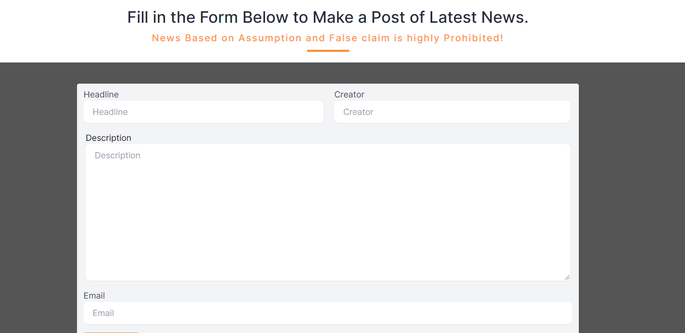

# The News Room

Welcome to the news room. This is a great app that lets the world know about the latest happenings around. You can log in to create a news post, edit created post and also view details of each post. Whether you want to create a post or just be updated about latest happenings around "The News Room" gets you covered.

## Table of Contents

- [Overview](#overview)

- [Features](#features)

- [Design](#design)

- [Tech Stack](#tech-stack)

- [Tool Kit](#tool-kit)

## Overview

## Functionality

#### General:
    - View news.

#### Create News
    - Add News by clicking create, only when a user is authenticated.

#### Edit News

    - Users can edit news and make updates.

#### News Details

    - View full details of a specific news upon clicking view details.
    - Details include additional information such as: source, email of user, the date and time a news was posted which comes from the database.

#### Log in

    - Users must be logged in before creating a post.

#### Register

    - Only registered users can log in and create a post.

## Design

The design for this project was born out of imagination and experience.

## Tech Stack

 &nbsp;&nbsp; &nbsp;&nbsp;

